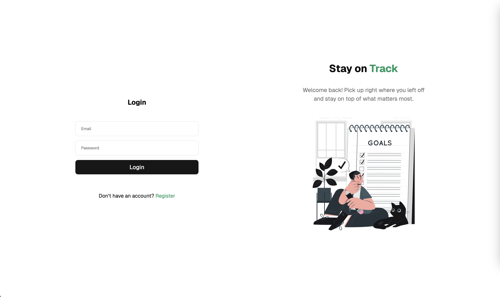
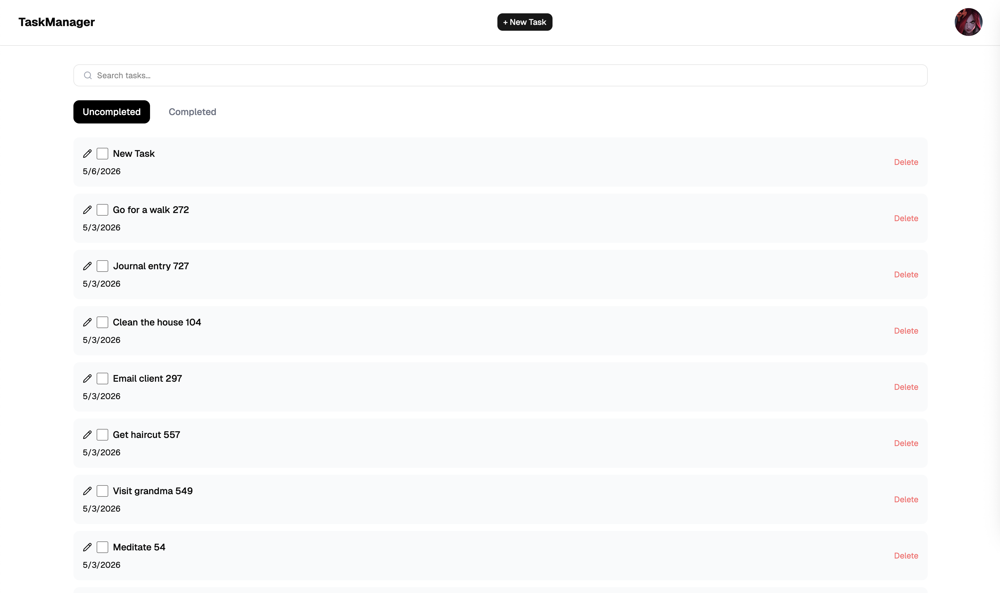
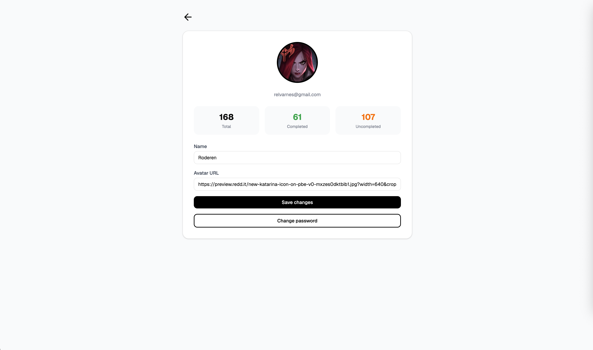

# Task Manager - Frontend

This repository contains the client-side application for a task management system, implemented to interface with a custom backend built with NestJS - [task-manager-nest-api](https://github.com/Roderen/task-manager-nest-api).

## About The Project

The application serves as a task management solution, allowing you to efficiently manage your task list. Key operations include creating tasks, editing tasks, deleting tasks, and marking tasks as complete.

## Screenshots

## Technology Stack

- **React**,
- **TypeScript**,
- **Vite**
- **Redux Toolkit + RTK Query**
- **React Router**,
- **Tailwind and shadcn/ui**

## Requirements
Node v22.22.2 (npm v10.9.7)

## How to run
Before that, clone the backend repository and run - [task-manager-nest-api](https://github.com/Roderen/task-manager-nest-api)

1. npm install
2. npm run dev